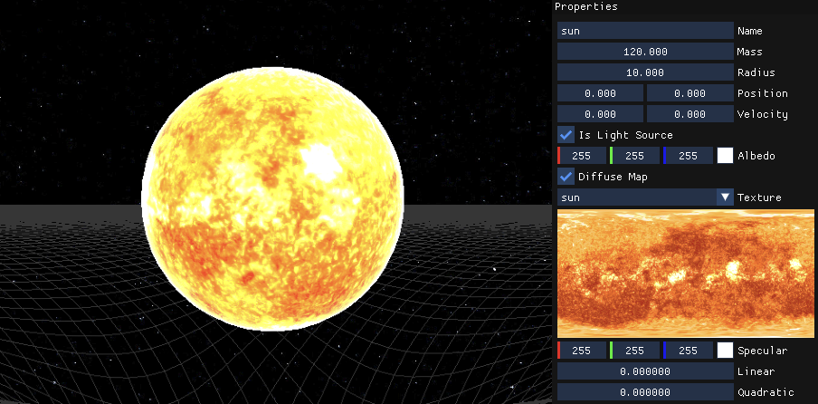
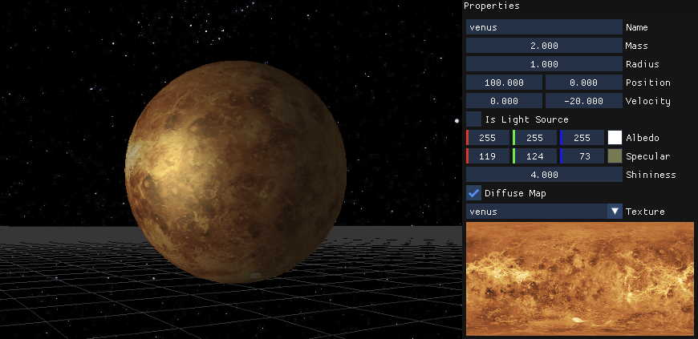

# Getting Started
By the end of this guide, you will have learned how to make a scene in Planetarium

## 1. Controls
Hold `Right Click` and move your mouse to look around your selected body. You can select which body to focus on from the `Scene` panel.

## 2. Interface
- The `Scene` panel is used to add bodies into your scene and see any others.
- The `Properties` panel is used to change the properties of your selected body *(e.g: name, position, color, mass, lighting...)*
- The `Simulation` panel is used to start/stop your simulation. You can only add bodies to the scene if the simulation is stopped.

## 3. Creating your first scene!

### STEP 1 - Create a Sun
Add a body from the `Scene` panel, seleect it, and give it a name. In the `Properties` panel make sure `Is Light Source` is checked. You can give increase the mass, radius, color (aka. albedo), and give it a texture by checking `Diffuse Map`.
> Adding a sun (or any light source) is the first thing you should do. If you forget it, you wont see your planets (space is dark.)

    
See photos

    

### STEP 2 - Create a Planet
Add another body like in **STEP 1**, and change its position. Just like last time you can style it as wanted, give it a mass, radius, and an initial velocity to make it go into orbit.
> If you dont see your planet, check if it's inside a bigger body, if so you might have to change its position.

> You can add as many planets as you want, tho the more you add the harder it is to make them orbit correctly!

    
See photos

    

### STEP 3 - Start the simulation
Once all your scene looks good, start the simulation by pressing `Start` in the `Simulation` panel and watch it do its magic. You can change the properties of the bodies in real time to have interesting interactions.